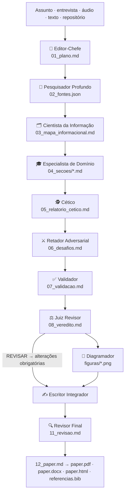

<div align="center">

# 🌶️ Papo Pepper

**Qualquer assunto vira um paper profundo.**

Uma equipe multi-agente de 12 papéis transforma um tema, uma entrevista, um áudio,
um texto pronto ou um repositório de código em um paper estruturado, atacado por céticos,
desafiado por adversariais, validado numericamente e julgado por um juiz — finalizado
em **PDF, Word, HTML e BibTeX**.

Roda em **Codex · Claude Code · OpenClaw · Hermes** — e em qualquer agente que leia skills.

</div>

---

## O que é o Papo Pepper

Quando você quer um paper técnico ou científico sério sobre um assunto — ou já tem o
conhecimento na cabeça (num áudio), um texto que precisa melhorar, ou um repositório que
precisa de documentação e de um paper para acompanhá-la — o Papo Pepper monta a equipe
editorial inteira que você contrataria:

1. **Entrevista você** conversacionalmente antes de escrever (assunto, público, dados, objeções, tom, citação)
2. **Pesquisa profunda na web** sem chave de API: DuckDuckGo + arXiv + Semantic Scholar (opcional)
3. **12 agentes especialistas** produzem artefatos com contrato de saída rígido
4. **Verifica a matemática**: fórmula computável roda em Python (sympy/numpy/scipy) e ganha o selo `✅ Checado`
5. **Cético → Retador → Validador sempre antes do Juiz** (veredito em JSON: `ACEITO`/`REVISAR` com pontuação)
6. **Exporta**: HTML editorial com CSS embutido, DOCX profissional (capa + sumário), PDF (3 engines), BibTeX, figuras Mermaid → PNG
7. **Sem LLM?** A pipeline gera *cartões de agente* (esqueletos) que você ou outro agente
   (Claude Code, Codex, OpenClaw, Hermes) completa etapa a etapa — o método nunca trava

## Como funciona



Detalhe de decisões e fluxo: [docs/ARQUITETURA.md](docs/ARQUITETURA.md) · Matriz dos 12 papéis: [docs/AGENTES.md](docs/AGENTES.md)

## Instalação

**Uma linha (Linux/macOS):**

```bash
curl -fsSL https://raw.githubusercontent.com/geniallabsai/papo-pepper/main/install.sh | bash
```

O instalador: detecta os agentes presentes (Codex, Claude Code, OpenClaw, Hermes), instala o
pacote Python com as skills, gera os adapters de plataforma e mostra a curadoria de modelos.
Opções: `--completo` (extras pdf/audio/math) · `--mcp` (registra o servidor MCP) · `--somente-agentes` · `--alvo codex|claude|openclaw|hermes|generico`.

**Manual:**

```bash
git clone https://github.com/geniallabsai/papo-pepper.git
cd papo-pepper
python3 -m pip install -e ".[math]"        # extras: [pdf] [audio] [dev]
papo-pepper setup                          # instala skills/adapters nos agentes detectados
papo-pepper models                         # o que está configurado + modelos recomendados
```

**Windows (PowerShell):** `powershell -ExecutionPolicy ByPass -File .\\install.ps1`

**Desinstalar:** `./uninstall.sh` (remove blocos marcados e skills copiadas).

## Usando

```bash
# paper do zero com entrevista (o modo recomendado)
papo-pepper novo "Filas de mensagem com Kafka para event-driven" --entrevista

# de um áudio do especialista (transcreve e extrai as teses)
papo-pepper novo "Minha tese sobre X" --audio conversa.m4a

# de um repositório: documentação + paper técnico
papo-pepper novo "Análise do meu sistema" --repo ./projeto

# analisar/melhorar material existente
papo-pepper analisar examples/material-exemplo.md

# exportar tudo de novo (PDF + Word + HTML + BibTeX)
papo-pepper exportar papers/2026-09-22-filas-de-mensagem-com-kafka

# estado da pipeline / reexecutar uma etapa com outro modelo
papo-pepper estado papers/2026-09-22-filas-de-mensagem-com-kafka
papo-pepper etapa juiz --paper papers/2026-09-22-tema --modelo gpt-5
```

Exemplo de sessão completa: [examples/sessao-exemplo.md](examples/sessao-exemplo.md) · Receitas e FAQ: [docs/GUIA-USO.md](docs/GUIA-USO.md)

## Como cada agente usa o Papo Pepper

| Agente | O que o instalador faz |
| --- | --- |
| **Claude Code** | 13 subagentes `pp-*` em `~/.claude/agents/` + skill orquestrador em `~/.claude/skills/papo-pepper/` + bloco em `CLAUDE.md`. Diga: *"use a equipe papo pepper para…"* |
| **Codex** | Bloco marcado em `~/.codex/AGENTS.md` + (com `--mcp`) `[mcp_servers.papo_pepper]` no `config.toml` |
| **OpenClaw** | As 13 skills em `~/.openclaw/workspace/skills/` + bloco em `AGENTS.md` do workspace |
| **Hermes** | Persona em `~/.hermes/agents/papo-pepper/AGENT.md` + cópia das skills |
| **Qualquer outro** | `papo-pepper setup --alvo generico` escreve um `AGENTS.md` portável no projeto |

Todas as regras do método vivem em `skills/papo-pepper/SKILL.md` — o orquestrador ensina a
pipeline completa, o mapa de artefatos e o critério de pronto para o agente que estiver lendo.

## Matemática, ML e dados

- O **Especialista** escreve equações em LaTeX e roda checagens (derivadas, valores, complexidade) marcando `✅ Checado computacionalmente: esperado → obtido`
- O **Validador** recomputa TODOS os cálculos do manuscrito ("show your work") e testa URLs de referência
- O servidor MCP expõe `pp_eval_python` (Python isolado com matplotlib/numpy/sympy quando instalados) e `pp_stats` (estatística com stdlib) para qualquer agente usar no meio da escrita — ver [docs/MCP.md](docs/MCP.md)

## Modelos recomendados

> **Sempre use a versão mais recente disponível no seu provedor** — a curadoria (atualizada 2026-09-22):
> Claude Opus/Sonnet 4.x · GPT-5 família · Gemini 2.5+/3 · DeepSeek V3.x/R1 · Llama 4 · Qwen3-Max.

Configure com `ANTHROPIC_API_KEY`, `OPENAI_API_KEY`, `OPENROUTER_API_KEY`, `OLLAMA=true` ou
`PAPER_BASE_URL` + `PAPER_API_KEY` (qualquer endpoint compatível com OpenAI). Detalhes e
estratégia por fase: [docs/MODELOS.md](docs/MODELOS.md).

## Estrutura do projeto

```
papo-pepper/
├── install.sh / install.ps1 / uninstall.sh   # instalador idempotente (blocos marcados)
├── pyproject.toml                            # pacote papo-pepper + extras [pdf][audio][math][dev]
├── papo_pepper/
│   ├── cli.py                                # novo · analisar · exportar · estado · etapa · models · setup · config
│   ├── orchestrator.py                       # pipeline de 11 fases sobre papers/<slug>/
│   ├── agents/base.py                        # os 12 papéis (rolo → artefato → contrato)
│   ├── prompts/                              # 14 cartões de agente em pt-BR
│   ├── llm.py                                # Anthropic / OpenAI-compat / OpenRouter / Ollama
│   ├── pesquisa.py                           # deep research: DDG + arXiv + Semantic Scholar
│   ├── intake.py                             # entrevista + transcrição + extração de teses
│   ├── analysis.py                           # análise de texto + perfil de repositório (AST/deps/CI)
│   ├── exporter/                             # html(CSS) · docx · pdf(3 engines) · bibtex · mermaid→PNG
│   ├── mcp_server.py                         # MCP stdio JSON-RPC, 10 ferramentas, zero deps
│   ├── installers.py                         # adapters Codex/Claude/OpenClaw/Hermes/generico
│   └── models.py                             # curadoria de modelos + dicas
├── skills/                                   # 14 SKILL.md — FONTE ÚNICA de todo o método
├── platforms/                                # gerado por tools/build_platforms.py
├── tests/                                    # suíte (run_all.py) · CI em .github/workflows/ci.yml
├── docs/                                     # ARQUITETURA · MODELOS · AGENTES · MCP · GUIA-USO
└── examples/                                 # sessão de exemplo + material para analisar
```

## Desenvolvimento

```bash
pip install -e ".[math,dev]"
python tests/run_all.py          # suíte: CLI, exports, MCP, pipeline offline, diagramas
python tools/build_platforms.py  # regenera platforms/ a partir de skills/
```

## Licença

MIT — [LICENSE](LICENSE). Feito pelo Drael, 2026.
