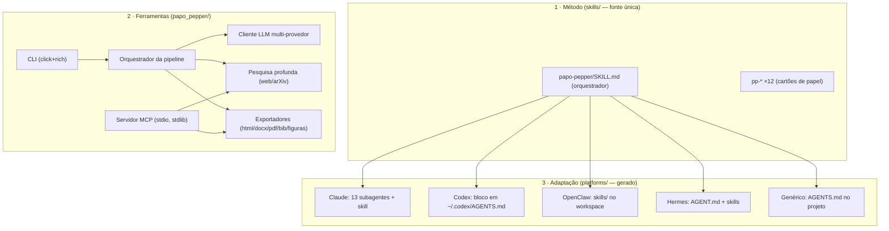

# Arquitetura do Papo Pepper

## Visão geral

Três camadas independentes que conversam por **arquivos**:

## Contratos de arquivo (papers/<AAAA-MM-DD>-<slug>/)

| Arquivo | Dono | Formato |
| --- | --- | --- |
| `00_intake.md` | entrevista/áudio/stub | markdown + yaml |
| `00_perfil_repositorio.json/.md` | analysis.analisar_repositorio | json + md (AST, deps, CI) |
| `01_plano.md` | editor | JSON fechado + racional |
| `02_fontes.json` + `02_notas_pesquisa.md` | pesquisador (+pesquisa.py) | lista de fontes tipada + síntese |
| `03_mapa_informacional.md` | cientista | taxonomia, pirâmide de evidência, numeração final |
| `04_secoes/*.md` | especialista | seções com [n] e "✅ Checado" quando matemático |
| `05_relatorio_cetico.md` | cetico | tabela de ataques com gravidade |
| `06_desafios.md` | retador | desafios + teste objetivo + ranking |
| `07_validacao.md` | validador | verificação "show your work" + checagens automáticas de URL |
| `08_veredito.md` (+`log/juiz.json`) | juiz | JSON: pontuação 6 dimensões, obrigatorias, ACEITO/REVISAR |
| `09_figuras.md` + `figuras/*` | diagramador | mermaid → PNG (mmdc → matplotlib → .mmd) |
| `10_manuscrito_final.md` | escritor | paper completo integrado |
| `11_revisao.md` | revisor | texto revisado + changelog |
| `12_paper.md` + `meta.json` | montador final | fonte única dos exports |
| `paper.pdf/.docx/.html` + `referencias.bib` | exporter | saídas finais |

## Decisões de projeto

1. **Skills = fonte única.** `platforms/` é 100% gerado por `tools/build_platforms.py`; nunca edite adapter à mão.
2. **Método não depende de LLM.** Sem provedor, cada fase vira *cartão do agente* (marcador `<!-- papo-pepper: esqueleto`). Qualquer agente externo (ou pessoa) lê o cartão e produz o artefato no formato contratado; `--forcar` re-executa só os esqueletos.
3. **Ordem crítica da crítica.** Cético → Retador → Validador SEMPRE antes do Juiz. O Juiz só emite `ACEITO` sem item bloqueante; o Escritor é obrigado a incorporar as alterações obrigatórias no texto final (não em nota de rodapé).
4. **Matemática verificável.** Especialista e Validador rodam código (numpy/scipy/sympy, via `pp_eval_python` do MCP ou subprocess) e marcam `✅ Checado computacionalmente: esperado → obtido`. Fórmula não checada declara "derivação analítica".
5. **Export com degradação graciosa.** PDF: weasyprint (HTML+CSS completo) → reportlab → fpdf2. DOCX: python-docx puro. HTML: standalone com CSS embutido. Mermaid: mmdc → renderer matplotlib próprio (subconjunto `graph TD/LR`) → `.mmd` puro.
6. **MCP sem dependências.** `mcp_server.py` é stdlib (JSON-RPC 2.0 linha a linha); pesquisa usa httpx quando disponível e degrada mensagem a mensagem.

## Fluxo de dados de uma frase
intake → plano(json) → fontes(json, enriquecidas pela web) → mapa(md) → secoes(md[]) → críticas(md×3) → veredito(json) → figuras(png) → manuscrito(md) → revisão(md) → 12_paper.md → {pdf, docx, html, bib}.
