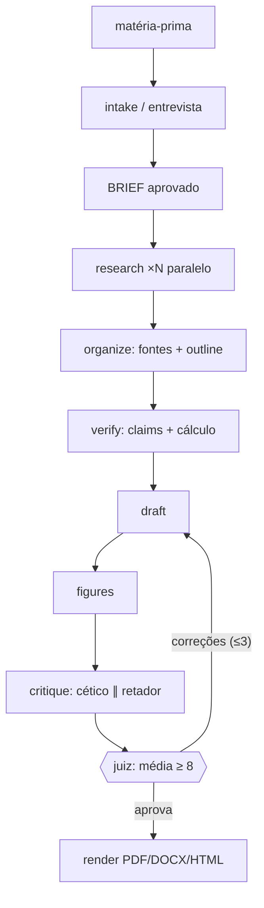

# Equipes editoriais multiagente para a produção de papers técnicos

**Autor:** usuário + equipe Papo Pepper · **Data:** 2026-09-22 · **Estilo:** IEEE

## Resumo
Este preprint descreve o Papo Pepper, um pipeline de agentes especializados que transforma
matéria-prima heterogênea (tema, áudio, texto, artigo, repositório) em papers profundos com
garantia de verificação. A arquitetura separa *produção* de *julgamento*: redatores escrevem;
validadores, céticos, retadores e um juiz notado aprovam. Três invariantes sustentam a
qualidade: toda afirmação factual tem fonte, todo número tem execução, e nenhum papel decide
sobre si mesmo [1][2].

**Palavras-chave:** agentes de linguagem; edição científica; verificação automática; multiagente

## 1. Introdução
### 1.1 Problema
Geradores únicos de texto produzem papers fluentes e frequentemente inverificáveis: fontes
inexistentes, números sem origem, método opaco. A falha raramente é de estilo — é de processo.

### 1.2 Abordagem
Separar papéis como numa redação real: pesquisa em paralelo, organização informacional,
validação executada, crítica adversarial e decisão por métrica — não por impressão [2].

## 2. Arquitetura

Figura 1 — Pipeline do Papo Pepper (especificação em `pipeline/pipeline.json`).

## 3. Papéis e responsabilidade única
| Papel | Responsabilidade exclusiva | Artefato-chave |
|---|---|---|
| Pesquisador Profundo | coleta em camadas com proveniência | `research/*.md` |
| Cientista da Informação | taxonomia, dedupe, outline | `sources.md`, `outline.md` |
| Validador | atestado de fonte/cálculo por afirmação | `claims.md` |
| Cético | falhas de método e evidência | `critique/cetico.md` |
| Retador | melhor caso contrário, de boa-fé | `critique/tese-contra.md` |
| Juiz | nota por critério; único poder de veto | `ruling.md` |

## 4. Garantia de qualidade
- **Fonte:** afirmação factual sem URL vira hipótese declarada.
- **Execução:** número alegado é reproduzido em `lab/*.py` antes de entrar no texto.
- **Veto:** aprovação exige média ≥ 8,0 em seis critérios e nenhum ≤ 6; máximo três rodadas.
- **Transparência:** cada veredito cita o trecho julgado; disputas são decididas por fonte ou cálculo.

## 5. Limitações
O pipeline depende da honestidade da ferramenta de busca subjacente: fonte falsa acessível é
fonte falsa verificada. A barra do juiz é calibrada para texto técnico; ensaios longos exigem
retuning dos pesos.

## 6. Conclusão
Tratar o paper como produto de equipe — e não de geração — converte qualidade de sorte em
qualidade de processo. Próximos passos: revisão cruzada por dois juízes independentes e
backend LaTeX estrito.

## Referências
1. Lewis, P. et al. (2020). *Retrieval-Augmented Generation for Knowledge-Intensive NLP Tasks.* arXiv:2005.11401.
2. Wu, Q. et al. (2023). *AutoGen: Enabling Next-Gen LLM Applications via Multi-Agent Conversation.* arXiv:2308.08155.
